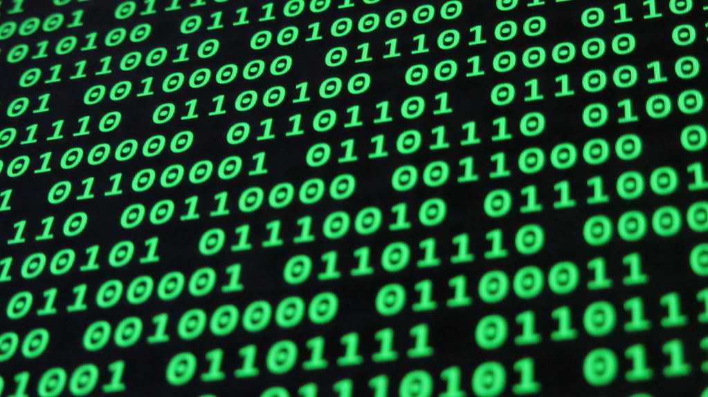

# Java 101
## What is programming?
<ul>
  <li>Programming is the act of telling a computer <i>exactly</i> what to do- no more, no less. This is why I love computers. While humans are particularly bad at obeying commands and executing them flawlessly, computers are rather perfectionists.</li>

  <li><i><b>"Why can't I just tell a computer what to do? Why do I have to learn how to program?"</b></i> asked the inquiring student. Well, dear student, computers don't exactly know what words mean. I'm sure you've seen programming in the movies or on the internet and I'm sure you've seen a lot of 1's and 0's. Actually, the only thing computers know the meaning of are <b>1's and 0's.</b></li>
</ul>
