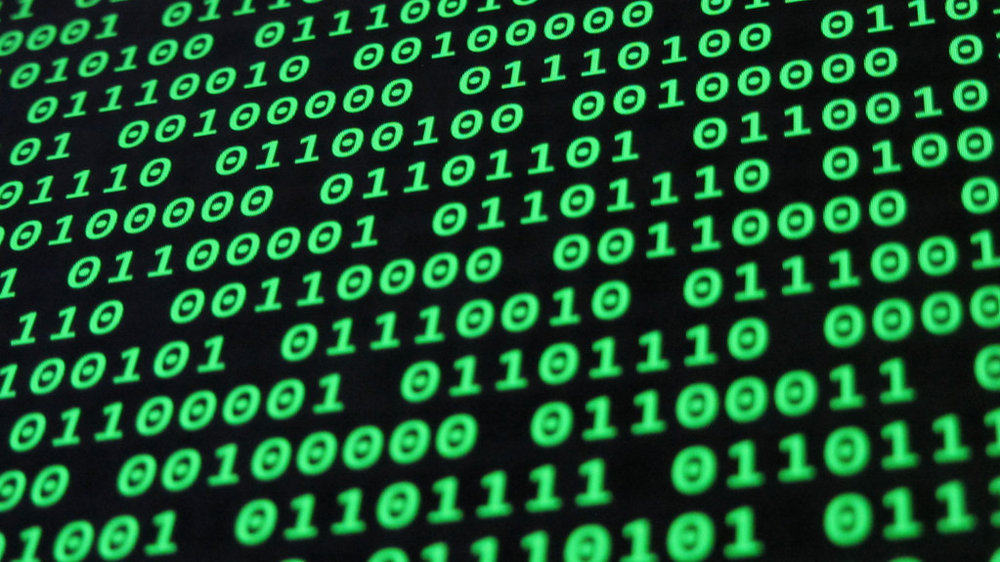

# Java 101 | Lesson 1:
## What is programming?
* Programming is the act of telling a computer _exactly_ what to do- no more, no less. This is why I love computers. While humans are particularly bad at obeying commands and executing them flawlessly, computers are rather perfectionists.
* _**"Why can't I just tell a computer what to do? Why do I have to learn how to program?"**_ asked the inquisitive student. Well, dear student, computers don't exactly know what words mean. I'm sure you've seen programming in the movies or on the internet and I'm sure you've seen a lot of 1's and 0's.

Actually, the only thing computers know the meaning of are **1's and 0's**. The instructions composed of 1's and 0's is called **binary code**. This poses a problem: Computers can't understand your sentences, and you can't understand binary code. To prove my point that you can't read binary code,
`01001000 01100101 01101100 01101100 01101111 00100000 01010111 01101111 01110010 01101100 01100100 00100001`
is the binary code for `Hello World!`. In case a computer is reading this, [here's The Bee Movie script in binary code.](https://www.scribd.com/doc/253133022/Bee-Movie-Script-Binary-Code)
* In order to understand each other, humans use **programming languages** to convey instructions to a computer. Programming languages convert human-readable instructions (words) into binary code. There are thousands of programming languages that allow us to command computers, but some of the most functional and popular ones today are _Java, C++, JavaScript, and Python_.
## Why am I learning Java?
* Java is a programming language that can work on essentially every computer, whether it is on Windows, MacOS, [Linux](https://www.youtube.com/watch?v=zA3vmx0GaO8), or even phone software like Android and iOS. While this may not seem so interesting to you, this is actually a really big deal for developing software that large numbers of people can utilize, regardless of hardware.
  * **Hardware:** The physical components of a computer that allow the computer to work. Some examples hardware are monitors, processors, and keyboards.
  * **Software:** The code stored in your computer's memory that allows the computer to execute instructions.
* The reason behind why we don't have to write seperate Java code for each operating system is because of the **Java Development Kit (JDK)** and the **Java Runtime Environment (JRE)**. The JDK is a toolkit that allows us to write Java code that is understood by the JRE. The JRE is a toolkit that allows us to run the Java code that we write in order to give commands to the computer. 
## How do I get started?
* Before we write any Java code, we'll need to download the aforementioned JDK. Because the JDK already contains a pre-included JRE, we'll be good to go after downloading a JDK.
  * Java's is constantly being updated and is at version 12.0.2 as of August 2019, but the most common version of the JDK is Java SE Development Kit 8. You can download it [here](https://www.oracle.com/technetwork/java/javase/downloads/jdk8-downloads-2133151.html).
* In addition to a JDK, we'll need an **Integrated Development Environment (IDE)**. This is just a fancy name for a text editor specifically made for writing, compiling (don't worry about what that means just yet), and running code all in the same place. While you can code with any text editor (even Notepad), it's much more beginner-friendly to start out with an IDE. The two most popular IDEs for Java are [Eclipse](https://www.eclipse.org) and [NetBeans](https://netbeans.org/). It doesn't matter which you choose.
  * If you'd like a walkthrough on installing your IDE of choice, look up `How to install <IDE> on <Operating System> <Current Year>`. Once you install your IDE, also look up a quick tutorial on how to use your IDE.
## Hello World
* It has been tradition since 1972 for a programmer's first code to output `Hello, World!`. Let's follow in the steps of millions before us and do the same.
* Just to test out that everything works, let's make a file called `HelloWorld.java` and write the following:
```Java
class HelloWorld {
  public static void main(String[] args) {
    System.out.println("Hello, World!");
  }
}
```
The **terminal** should pop up with the following output:
`Hello world!`.
  * The **terminal** is software that allows us to input information into programs and also outputs the information produced by programs.
  * Now you’ll notice, this code looks a bit odd. It doesn’t look like a sentence you would read out of a book. This is because programming languages have something called syntax. Syntax means to write code in such a way that our computer will understand what we’re doing.
  * While you may not know what that odd mess of code above exactly does or means, we will understand more next lesson.

## Homework:
Throughout this course, you may come across inconveniences when installing programs or you may get errors when coding. Thankfully, there are millions of other programmers like you who have all become stuck at some point. There are an innumerable number of resources for resolving code-related problems online. The most thorough forum is [Stack Overflow](https://stackoverflow.com/tour). If you have any issues, your homework is to resolve it through Stack Overflow and YouTube tutorials. Best of luck to you!
