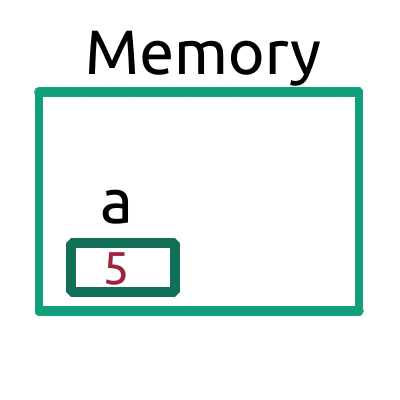

# Java 101 | Lesson 3:
## Variables:
In computer science, **variable** is a name for a place in memory that can store values. Let's take a look at the diagram below.
<br>

<br>
Above, you can see a portion of memory with a predetermined size storing the number `5`. The variable, or portion of allocated memory, that is capable of storing numbers is called `a` in the diagram above. Appropriately named, `variables` can vary. `a` can just as easily contain any value, as long as it can store it within the size of its allocated memory.
If we wanted to make a variable with name `a` and value `5` in java, all it would require would be:
```Java
int a = 5;
```
If we wanted to read this out, we would say _integer a is assigned 5_. Here's how the above line works:
* `int` is a **data type** (reviewed next section) that lets our program know that we'll be storing a whole number within a.
* `a` is the **variable name**. All this does is **allocate** a portion of memory and name it `a`.
* `=` is the **assignment operator**. The assignment operator assigns the _value_ on the right side of the operator to the variable on the left side of the operator.

## Data Types:
Earlier, we mentioned that `a` had a _predetermined_ size. This means that the program knows how much memory to allocate to variable `a` before trying to store a value. How did the program know how much memory to allocate?
We specified `a`'s data type as an `int`. `int` is one of the many data types. Let's review some data types:
* Data types can be separated as **primitive** or **non-primitive**. Primitive data types are data types that are built into Java. Non-primitive data types are not built into Java. For now, all you need to know that primitive data types are all lowercase whereas non-primitive data types are capitalized.
### Primitive Data Types:

* `int`: The **integer** data type can store whole numbers that do not contain decimal points. 
  * `int` can be negative, zero, or positive. `int` allows values between -2,147,483,648 and 2,147,483,647, inclusive.
  * Let's say you wanted to make an app that stored a user's grades. If you wanted to store the number of courses the user is taking, you would store it within an `int` object because courses are counted with whole numbers (you can't take 0.23 of a class!).
  * The size of `int` is 4 bytes. (See `byte` for more.)
```Java
int courseNumber = 7;
```
* `byte`: The **byte** data type is similar to `int` as it only stores numbers from -128 to 127, inclusive.
  * As byte is the smallest primitive data with a set size, it's also used as a measurement for memory. The sizes of the rest of the data types will be measured in bytes.
* `short`: The **short** data type also stores whole numbers. The range of `short` is from	-32,768 to 32,767, inclusive.
  * The size of `short` is 2 bytes.
* `long`: The **long** data type also stores whole numbers. The range of `long` is from	-9,223,372,036,854,775,808 to 9,223,372,036,854,775,807, inclusive.
  * The size of `long` is 8 bytes.
* `float`: The **float** data type can store numbers that contain decimal points.
  * If you wanted to store the numerical grade that the user had in a class, you would use a float.
  * The size of `float` is 4 bytes.
```Java
float mathAverage = 89.3;
```
* `double`: The **double** data type is similar to `float` but has a much larger capacity. This is because the memory required for `double` is _double_ that of `float`. The capacity of double is approximately ±1.8 * 10^308, with 15 significant decimal digits. That is absurdly precise.
  * The size of `double` is 8 bytes.

* `char`: The **character** data type can store single characters that are within the [Unicode Standard](https://en.wikipedia.org/wiki/Unicode). Unicode is the global standard for text in software.
  * If you wanted to store the letter grade for one of the courses the user is taking you would use a `char`. Because letter grades can only be displayed as `A`, `B`, `C`, `D`, or `F`, it makes sense to store it within a `char` variable.
  * When assigning a character, be sure to encapsulate the specific character in single quotations. 
  * Whether a character is capital or not matters! In Java, `'A'` and `'a'` are different `char`s!
  * The size of `char` is 2 bytes.
```Java
char mathLetter = 'A';
```
* `boolean`: The **Boolean** data type can store only two values, `true` or `false`.
  * If you wanted to know if the user is passing all of their classes, you would use a boolean. This is because you can only pass or fail a class. In other words, your passing status can only be `true` or `false`.
  * The size of `boolean` is not defined precisely.
```Java
boolean isPassing = true;
```
### Non-primitive Data Types:
All you need to know for non-primitive data types for now is the `String`.
* `String`: The **string** data type is used to store words and multiple characters together. The data type is named after it literally being a _string_ of `char`s appended together.
  * If you wanted to store the user's name, you'd use a `String`.
  * An empty String uses 40 bytes. The memory usage of the String increases with the number of characters contained within. This is largely unimportant for our purposes.
```Java
String userName = "John Doe";
```
## Putting it together:
### Declaration:
Sometimes, you may not know the value of a variable instantly but will later compute it. If this is the case, you must declare a variable. **Declaration** is telling the program to reserve memory under a variable name with a specific data type.
```Java
// The format is [data type] [variable name]
byte a;
short b;
int c;
long d;
float e;
double f;
char g;
boolean h;
String i;
```
#### Default Values of Java Data Types:
If you declare variables but don't assign a value to them, the variables will be left with their default values.
Below is a chart of data types along with the sizes, default values, and ranges:

Data type | Size (bytes) | Default Value | Range
--- | --- | --- | ---
byte | 1 | `0` | -128 to 127
short | 2 | `0` | -32,768 to 32,767
int | 4 | `0` | -2,147,483,648 to 2,147,483, 647
long | 8 | `0` | approx. ±9.223 * 10^18 (whole numbers)
float | 4 | `0.0` | approx. ±3.4 * 10^38 (6-7 decimal digits) 
double | 8 | `0.0` | approx. ±1.8 * 10^308 (15 decimal digits)
char | 2 | `'\u0000'` | [See UTF-16](https://unicode.org/faq/utf_bom.html)
boolean | N/A | `false` | true or false
String | N/A | `null` | N/A
